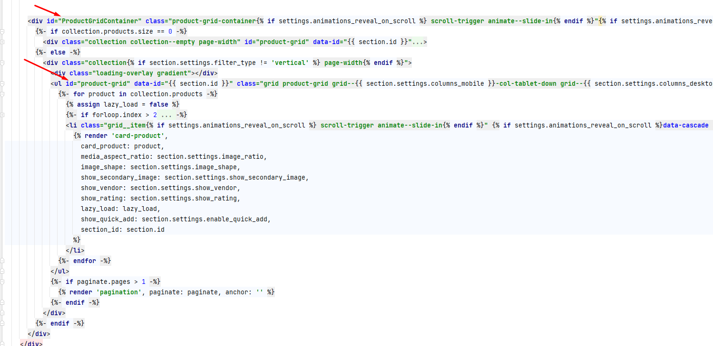

# Product Filter

This code snippet can be used to display the product filter in a vertical format on desktop screens and as a drawer filter on mobile screens.

## How to Use
1. migrate given folders to appropriate folders of your theme.
  
1. Use Following snippet to call wherever you want to show sidebar.  (Mostly in Collection page)
    ```liquid
        {{ 'sidebar-filter.css' | asset_url | stylesheet_tag }}
        <script src="{{ 'sidebar-filter.js' | asset_url }}" defer="defer"></script>
    
         
        
        
    ```
1. You should add the id `id="product-grid"` in the product items parent element and Grandparents add the id `id="ProductGridContainer"`.
   - Exmaple:   