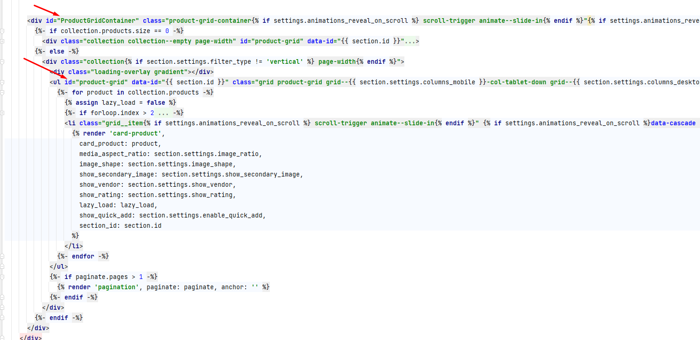

# Product Filter

## About
This snippet will help you show the Product filter as a vertical filter on Desktop screens and the Drawer filter on Mobile screens.
## How to Use

1. There are 3 files in this folder that you have to put it in `snippets` directory:
   - sortby-filter-desktop.liquid
   - desktop-sidebar-filter.liquid
   - mobile-sidebar-filter.liquid

2. After that you can call this snippet wherever you want to show this collection page and search page.
    ```liquid
         
        
        
    ```

3. You also 2 files move/merge the given  CSS and JS Files `sidebar-filter.css` and  `sidebar-filter.js` in the assets folder. Attach it with your theme either in `layout/theme.liquid` or wherever you are calling the given snippet
    ```html
    {{ 'sidebar-filter.css' | asset_url | stylesheet_tag }}
    <script src="{{ 'sidebar-filter.js' | asset_url }}" defer="defer"></script>
    ```
4. You have to add the id `id="product-grid"` in the product items parent element and Grandparents add the id `id="ProductGridContainer"`.
   - Like the below definition.
 
   