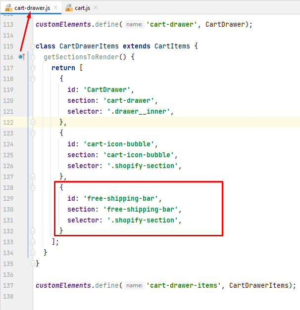
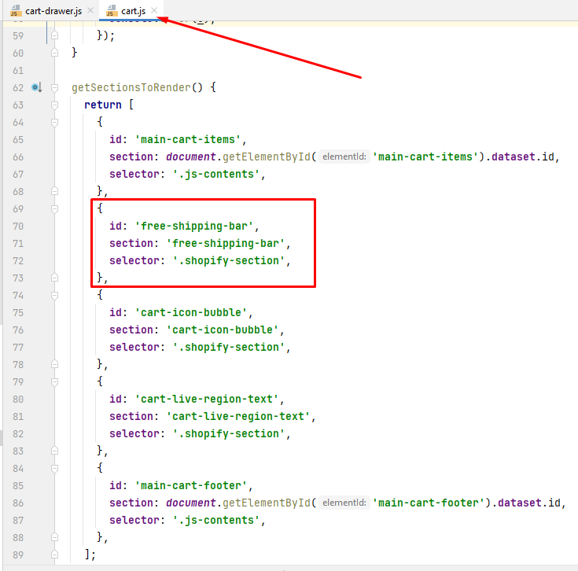
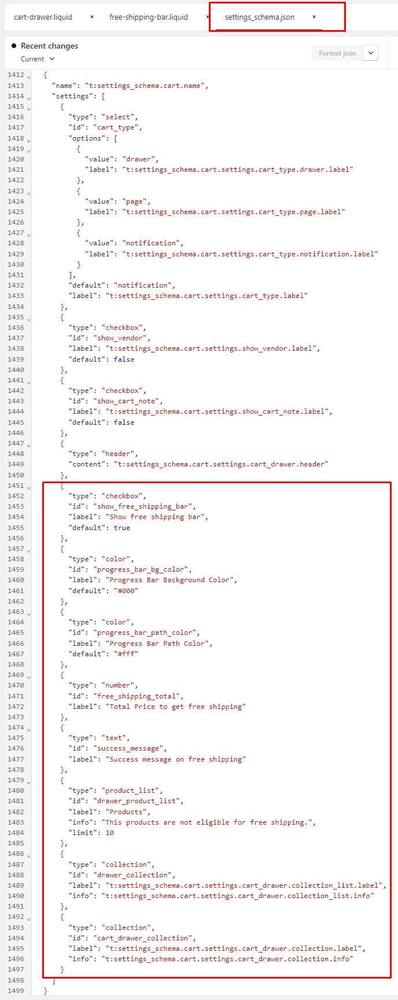
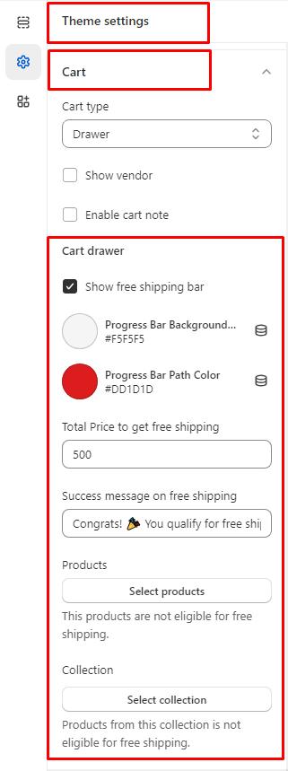

## About
------------
You can set a free shipping bar to show customers that if they add products worth the total then they get free shipping.

## How to Use
------------
1. There are 2 files in this folder that you have to put in the `snippets` and  `assets` directory:
   - free-shipping-bar.liquid
   - free-shipping-bar.css
   

1. After that, you can call this snippet and assets files wherever you want to show this cart drawer and cart page.
   ```html
    {{ 'free-shipping-bar.css' | asset_url | stylesheet_tag }}
    
   ```
1. Add the given code to your cart-drawer.js and cart.js JS files `getSectionsToRender()` function
    ```json
        {
            id: 'free-shipping-bar',
            section: 'free-shipping-bar',
            selector: '.shopify-section',
        }
   ```
    - You have to compulsory add code In cart-drawer.js and cart.js JS files `getSectionsToRender()` function like the below to define

      | Cart Drawer  | Cart Page |
      | ------------- | ------------- |
      |   |   |
    
   

2. After that copy below code and paste it in your theme's `settings_schema.json` file where '**cart drawer**' settings located.
   ```html
      {
         "type": "checkbox",
         "id": "show_free_shipping_bar",
         "label": "Show free shipping bar",
         "default": true
      },
      {
         "type": "color",
         "id": "progress_bar_bg_color",
         "label": "Progress Bar Background Color",
         "default": "#000"
      },
      {
         "type": "color",
         "id": "progress_bar_path_color",
         "label": "Progress Bar Path Color",
         "default": "#fff"
      },
      {
         "type": "number",
         "id": "free_shipping_total",
         "label": "Total Price to get free shipping"
      },
      {
         "type": "text",
         "id": "success_message",
         "label": "Success message on free shipping"
      },
      {
         "type": "product_list",
         "id": "drawer_product_list",
         "label": "Products",
         "info": "This products are not eligible for free shipping.",
         "limit": 10
      }
   ```

   - You have to compulsory add code In settings-schema.json like the one below to define

      | Settings schema Code | Theme settings |
      | ------------- | ------------- |
      |  |   |

